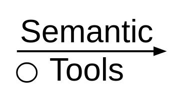

# semgrep

Reimplementation of the GNU grep tool with the following features:

- understands this RegEx flavor <a href="https://github.com/julienlargetpiet/Simple_RegEx">Simple_regEx</a>
- Give the current line of the matched patterns
- Colors the patterns matched

## Usage

After compilation:

```
$ cat file.txt | ./a.out "pattern to match" row_to_search_in(optional) bottom_range_row_number-top_range_row_number(optional) ...
```

Note that the number of the rows you want the programm to perform in must be ascendly sorted.

## Use it conveniently

You can create a bash alias.

# semsub

Reimplementation of the GNU sed with the following synthax

- understands this RegEx flavor <a href="https://github.com/julienlargetpiet/Simple_RegEx">Simple_regEx</a>

## Usage

```
$ ./a.out file.txt pattern_to_replace replacer_pattern row_to_search_in(optional) bottom_range_row_number-top_range_row_number(optional) ...
```

Note that the number of the rows you want the programm to perform in must be ascendly sorted.

## Use it conveniently

You can create a bash alias.

