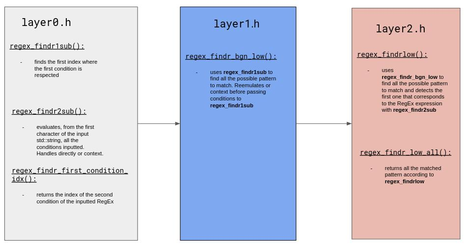
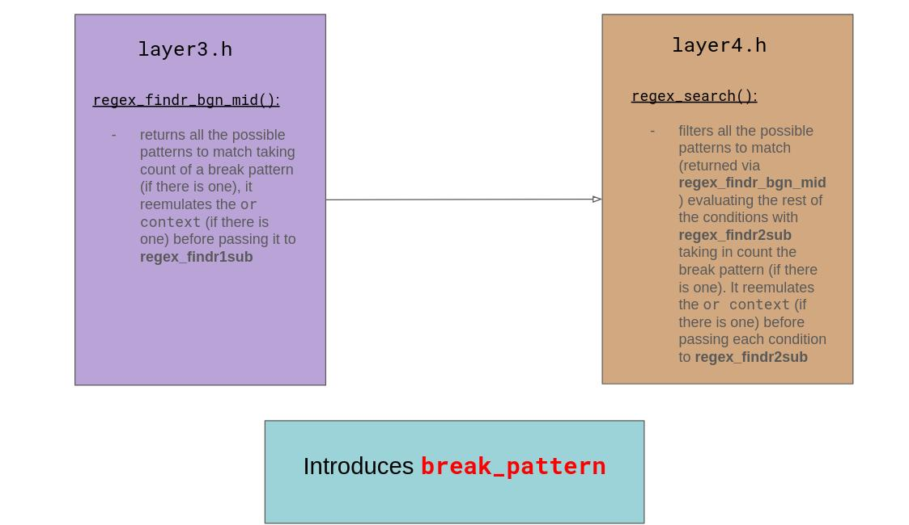
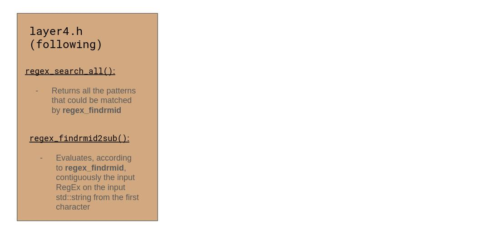

# Simple_RegEx


## Features

- **or context** which is the set of elements that are inside `[]`, evaluates the expression from left to right 
- **range elements** matches every elements that are between `x-y` acording to the ASCII table
- **repetition** is the number of times a set of elements have to be matched, this is declared inside `{n}` after the set of elements
- **greedyness** allows to match a given number of times, or more, a set of elements or more, this is declared by `{+n}` after the set of elements
- **greedyness until break pattern** allows to match an unknown number of times a set of elements until it does not match anymore or it encounters another pattern (named break pattern) It is declared with `{?break_pattern}`
- '\\' is used to escape special characters, apart when it is in a range context, so `\\-x` or `x-\\` are valid

The rule of thumb is to not put same set of elements side to side.

In **or context**, do not put set of elements that have commun elements. Convert them to multiple exactly different sets with no commun elements.

The or context repetition prevails the element repetition, such as its break pattern.

## How it works ?







## Usage

`regex_search(std::string &searched, std::string &x)`

- searched is the RegEx expression
- x is the string to search in

## Examples

```
std::string inpt_str = "aouppplchdcpdeudmePpuu";
std::string searched = "u{0}up{3}lchdy{+0}c{+0}";
std::map<std::vector<unsigned int>, std::map<bool, std::string>> outmp = regex_search(searched, inpt_str);
std::map<std::vector<unsigned int>, std::map<bool, std::string>>::iterator it = outmp.begin();
std::vector<unsigned int> vec1 = it->first;
std::map<bool, std::string>::iterator it2b = it->second.begin();
std::cout << vec1[0] << "\n";
std::cout << vec1[1] << "\n";
std::cout << it2b->first << "\n";
std::cout << it2b->second << "\n";
```

```
1
11
1
ouppplchdcp
```

```
std::string inpt_str = "uouuupeieeeppppiimi";
std::string searched = "[u{1}p{2}]{+1}ii[a-em]";
std::map<std::vector<unsigned int>, std::map<bool, std::string>> outmp = regex_search(searched, inpt_str);
std::map<std::vector<unsigned int>, std::map<bool, std::string>>::iterator it = outmp.begin();
std::vector<unsigned int> vec1 = it->first;
std::map<bool, std::string>::iterator it2b = it->second.begin();
std::cout << vec1[0] << "\n";
std::cout << vec1[1] << "\n";
std::cout << it2b->first << "\n";
std::cout << it2b->second << "\n";
```

```
11
17
1
ppppiim
```

```
std::string inpt_str = "uouuupeieeeppppiimi";
std::string searched = "e{+1}p{2}";
std::map<std::vector<unsigned int>, std::map<bool, std::string>> outmp = regex_search(searched, inpt_str);
std::map<std::vector<unsigned int>, std::map<bool, std::string>>::iterator it = outmp.begin();
std::vector<unsigned int> vec1 = it->first;
std::map<bool, std::string>::iterator it2b = it->second.begin();
std::cout << vec1[0] << "\n";
std::cout << vec1[1] << "\n";
std::cout << it2b->first << "\n";
std::cout << it2b->second << "\n";
```

```
8
12
1
eeepp
```

```
std::string inpt_str = "uouuupeieeeppppiimi";
std::string searched = "[a-ia-z]{+1}";
std::map<std::vector<unsigned int>, std::map<bool, std::string>> outmp = regex_search(searched, inpt_str);
std::map<std::vector<unsigned int>, std::map<bool, std::string>>::iterator it = outmp.begin();
std::vector<unsigned int> vec1 = it->first;
std::map<bool, std::string>::iterator it2b = it->second.begin();
std::cout << vec1[0] << "\n";
std::cout << vec1[1] << "\n";
std::cout << it2b->first << "\n";
std::cout << it2b->second << "\n";
```

```
5
10
1
eieee
```

```
std::string inpt_str = "aaaouppplchdcpdedmePp";
std::string searched = "[lmpu]{0}up{3}lchdy{+0}p{1}";
std::map<std::vector<unsigned int>, std::map<bool, std::string>> outmp = regex_search(searched, inpt_str);
std::map<std::vector<unsigned int>, std::map<bool, std::string>>::iterator it = outmp.begin();
std::vector<unsigned int> vec1 = it->first;
std::map<bool, std::string>::iterator it2b = it->second.begin();
std::cout << vec1[0] << "\n";
std::cout << vec1[1] << "\n";
std::cout << it2b->first << "\n";
std::cout << it2b->second << "\n";
```

```
3
13
1
ouppplchdcp
```

### Break patterns

Break patterns are used after a set of elements to significate their greedyness until it encounters a certain pattern. They are declared with `{?pattern}`

```
std::string inpt_str = "uuppplchhdcpdedmepp";
std::string searched = "[u{1}]{2}p{3}[lpm]{?p{3}}chh{?mepp}d{?mepp}";
std::map<std::vector<int<, std::map<bool, std::string<< outmp = regex_search(searched, inpt_str);
std::map<std::vector<int<, std::map<bool, std::string<<::iterator it = outmp.begin();
std::vector<int< vec1 = it-<first;
std::map<bool, std::string<::iterator it2b = it-<second.begin();
std::cout << vec1[0] << "\n";
std::cout << vec1[1] << "\n";
std::cout << it2b->first << "\n";
std::cout << it2b->second << "\n";
```

```
0
9
1
"uuppplchhd"
```

```
inpt_str = "uouuupeieeeppppiimiooo";
searched = "[p]{4}i{?ooo}i[a-zm]";
outmp = regex_search(searched, x);
it = outmp.begin();
vec1 = it-<first;
it2b = it-<second.begin();
vec1[0] << "\n";
vec1[1] << "\n";
it2b->first << "\n";
it2b->second << "\n";
```

```
11
17
1
"ppppiim"
```

```
inpt_str = "uuppplchhdcpdedmeppuu uuppplchhdcpdedmeppuuppplchhdcpdedmepp";
searched = "u{2}p{3}[lpm]{?p{3}}c[o{2}oh]h{?mepp}d{?mepp}[ao]{0}";
std::map<std::vector<int>, std::map<bool, std::string>> out_mp = regex_search(searched, inpt_str);
std::map<std::vector<int>, std::map<bool, std::string>>::iterator out_it = out_mp.begin();
std::vector<int> idx_v = out_it->first;
std::map<bool, std::string>::iterator rslt_mp = out_it->second.begin();
std::string rtn_str = rslt_mp->second;
bool is_found = rslt_mp->first;
std::cout << idx_v[0] << "\n";
std::cout << idx_v[1] << "\n";
std::cout << is_found << "\n";
std::cout << rtn_str << "\n";
```

```
0
10
1
uuppplchhdc
```

## Important 

If the first condition is an or context with multiple conditions, make sure to repeat this condition as it follows. (for the set of characters that have a repetition strictly superior to 0)

```
inpt_str = "Caaaaaaaaaaa_aaasympa où l'on pourrait randonner ?";
searched = "[a-z{+1}_{+1}]{?sympa}[a-z{+0}_{+0}]{?sympa}";
std::map<std::vector<int>, std::map<bool, std::string>> out_mp = regex_search(searched, inpt_str);
std::map<std::vector<int>, std::map<bool, std::string>>::iterator out_it = out_mp.begin();
std::vector<int> idx_v = out_it->first;
std::map<bool, std::string>::iterator rslt_mp = out_it->second.begin();
std::string rtn_str = rslt_mp->second;
bool is_found = rslt_mp->first;
std::cout << idx_v[0] << "\n";
std::cout << idx_v[1] << "\n";
std::cout << is_found << "\n";
std::cout << rtn_str << "\n";
```

```
1
15
1
aaaaaaaaaaa_aaa
```

```
std::string inpt_str = "Le radiateur fonctionne bien.";
std::string searched = "[A-Z a-z][A-Z{+1}a-z{+1} {+1}]{?bien}[A-Z{0}]{+1}";

std::map<std::vector<int>, std::map<bool, std::string>> out_mp = regex_search(searched, inpt_str);
std::map<std::vector<int>, std::map<bool, std::string>>::iterator out_it = out_mp.begin();
std::vector<int> idx_v = out_it->first;
std::map<bool, std::string>::iterator rslt_mp = out_it->second.begin();
std::string rtn_str = rslt_mp->second;
bool is_found = rslt_mp->first;
if (is_found) {
  std::cout << idx_v[0] << "\n";
  std::cout << idx_v[1] << "\n";
  std::cout << is_found << "\n";
  std::cout << rtn_str << "\n";
} else {
  std::cout << "not found\n";
};
```

```
0
28
1
Le radiateur fonctionne bien.
```


